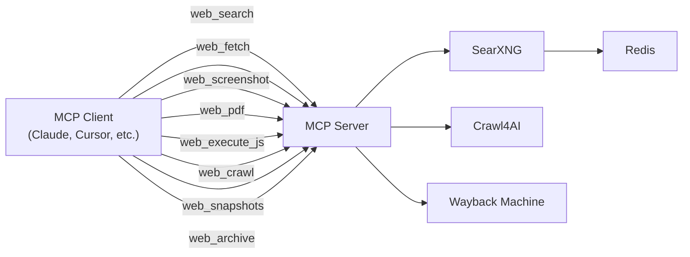

# Web Search MCP

[](https://railway.app/template/web-search-mcp)

An [MCP](https://modelcontextprotocol.io/) server that provides eight tools: a **web search** powered by [SearXNG](https://github.com/searxng/searxng), five [Crawl4AI](https://github.com/unclecode/crawl4ai)-powered tools (**web_fetch**, **web_screenshot**, **web_pdf**, **web_execute_js**, **web_crawl**), and two [Wayback Machine](https://web.archive.org/) tools (**web_snapshots**, **web_archive**).

## Architecture



The `web_search` tool queries SearXNG for search results. The Crawl4AI tools handle content extraction, screenshots, PDFs, JS execution, and multi-URL crawling. The Wayback Machine tools list and retrieve archived pages.

The full stack deploys as **4 services**: Redis, SearXNG, Crawl4AI, and this MCP server.

## Tools

The server exposes eight MCP tools:

### `web_search`

Lightweight web search via SearXNG. Returns structured results.

| Parameter | Type              | Description                                  |
| --------- | ----------------- | -------------------------------------------- |
| `query`   | string (required) | The search query                             |
| `limit`   | number (optional) | Max results to return (default: 10, max: 20) |

Returns a JSON array of `{ url, title, description }` results.

### `web_fetch`

Fetch a single URL and return its content as clean markdown via Crawl4AI.

| Parameter | Type              | Description                                                              |
| --------- | ----------------- | ------------------------------------------------------------------------ |
| `url`     | string (required) | URL to fetch                                                             |
| `f`       | enum (optional)   | Content-filter strategy: `raw`, `fit`, `bm25`, or `llm` (default: `fit`) |
| `q`       | string (optional) | Query string for BM25/LLM filters                                        |

Returns the page content as markdown.

### `web_screenshot`

Capture a full-page PNG screenshot of a URL via Crawl4AI.

| Parameter             | Type              | Description                                 |
| --------------------- | ----------------- | ------------------------------------------- |
| `url`                 | string (required) | URL to screenshot                           |
| `screenshot_wait_for` | number (optional) | Seconds to wait before capture (default: 2) |

Returns a base64-encoded PNG image.

### `web_pdf`

Generate a PDF document of a URL via Crawl4AI.

| Parameter | Type              | Description           |
| --------- | ----------------- | --------------------- |
| `url`     | string (required) | URL to convert to PDF |

Returns a base64-encoded PDF.

### `web_execute_js`

Execute JavaScript snippets on a URL via Crawl4AI and return the full crawl result.

| Parameter | Type                | Description                                     |
| --------- | ------------------- | ----------------------------------------------- |
| `url`     | string (required)   | URL to execute scripts on                       |
| `scripts` | string[] (required) | List of JavaScript snippets to execute in order |

Returns the full CrawlResult JSON including markdown, links, media, and JS execution results.

### `web_crawl`

Crawl one or more URLs and extract their content using Crawl4AI.

| Parameter        | Type                | Description                    |
| ---------------- | ------------------- | ------------------------------ |
| `urls`           | string[] (required) | List of URLs to crawl          |
| `browser_config` | object (optional)   | Crawl4AI browser configuration |
| `crawler_config` | object (optional)   | Crawl4AI crawler configuration |

Returns the extracted content from each URL.

### `web_snapshots`

List Wayback Machine snapshots for a URL.

| Parameter    | Type              | Description                                                             |
| ------------ | ----------------- | ----------------------------------------------------------------------- |
| `url`        | string (required) | URL to check for snapshots                                              |
| `from`       | string (optional) | Start date in YYYYMMDD format                                           |
| `to`         | string (optional) | End date in YYYYMMDD format                                             |
| `limit`      | number (optional) | Max number of snapshots to return (default: 100)                        |
| `match_type` | enum (optional)   | URL matching: `exact`, `prefix`, `host`, or `domain` (default: `exact`) |
| `filter`     | string[] (optional) | CDX API filters (e.g. `["statuscode:200", "mimetype:text/html"]`)      |

Returns a JSON array of snapshots with timestamps, status codes, and archive URLs.

### `web_archive`

Retrieve an archived page from the Wayback Machine.

| Parameter   | Type               | Description                                                          |
| ----------- | ------------------ | -------------------------------------------------------------------- |
| `url`       | string (required)  | URL of the page to retrieve                                          |
| `timestamp` | string (required)  | Timestamp in YYYYMMDDHHMMSS format                                   |
| `original`  | boolean (optional) | Get original content without Wayback Machine banner (default: false) |

Returns the archived page content.

## Connecting to the Server

All examples below assume your server is running at `https://your-server.up.railway.app/mcp` with an API key. Replace the URL and key with your own values.

### Claude Code (CLI)

```bash
claude mcp add web_search \
  --transport http \
  https://your-server.up.railway.app/mcp \
  --header "Authorization: Bearer your-api-key"
```

### Project-level config (`.mcp.json`)

Add to `.mcp.json` at the root of any project to make the tool available to all collaborators:

```json
{
  "mcpServers": {
    "web_search": {
      "type": "http",
      "url": "https://your-server.up.railway.app/mcp",
      "headers": {
        "Authorization": "Bearer your-api-key"
      }
    }
  }
}
```

### Claude Desktop (`claude_desktop_config.json`)

```json
{
  "mcpServers": {
    "web_search": {
      "type": "http",
      "url": "https://your-server.up.railway.app/mcp",
      "headers": {
        "Authorization": "Bearer your-api-key"
      }
    }
  }
}
```

### Replace Claude Code's Built-in Web Search & Web Fetch (Optional)

By default, Claude Code uses its own `WebSearch` and `WebFetch` tools. You can replace them with this server's `web_search` and `web_fetch` tools for privacy-respecting, self-hosted results.

**1. Add the MCP server globally:**

```bash
claude mcp add web_search --scope user \
  --transport http \
  https://your-server.up.railway.app/mcp \
  --header "Authorization: Bearer your-api-key"
```

**2. Disable the built-in tools** by editing `~/.claude/settings.json`:

```json
{
  "permissions": {
    "deny": ["WebSearch", "WebFetch"]
  }
}
```

**3. Guide Claude via `~/.claude/CLAUDE.md`** so it uses your tools:

```markdown
## Search & Fetch

- Use the web_search MCP tool for all web searches
- Use the web_fetch MCP tool to fetch and read web pages
- Do not attempt to use the built-in WebSearch or WebFetch tools
```

**4. Verify** by running `/mcp` inside Claude Code to check the server is connected, then ask Claude to search for something or fetch a URL.

## Deployment

### Railway

This project deploys as 4 services on Railway:

1. **Redis** - Cache for SearXNG
2. **SearXNG** - Meta search engine
3. **Crawl4AI** - Browser automation service
4. **MCP Server** - This web-search-mcp server

#### Deploy Steps:

1. **Fork/Clone** this repository to your GitHub account

2. **Create a new project** on [Railway](https://railway.app/)

3. **Deploy Redis:**
   - Click "Add Service" → "Database" → "Redis"

4. **Deploy SearXNG:**
   - Click "Add Service" → "Image"
   - Image: `searxng/searxng:latest`
   - Add port: `8080`
   - Set `SEARXNG_SECRET_KEY` and `SEARXNG_REDIS_URL` environment variables

5. **Deploy Crawl4AI:**
   - Click "Add Service" → "Image"
   - Image: `unclecode/crawl4ai:latest`
   - Add port: `11235`
   - (Optional) Set `CRAWL4AI_API_TOKEN` environment variable

6. **Deploy MCP Server:**
   - Click "Add Service" → "GitHub Repo"
   - Select your forked repository
   - Railway will auto-detect the Dockerfile
   - Set environment variables:
     - `API_KEY` - Your secret API key (use `${{random(32)}}` to generate)
     - `CRAWL4AI_URL` - `http://crawl4ai.railway.internal:11235` (or your Crawl4AI service URL)

5. **Get your URL** and test:
   ```bash
   curl -X POST https://your-service.up.railway.app/mcp \
     -H "Authorization: Bearer your-api-key" \
     -H "Content-Type: application/json" \
     -d '{"jsonrpc":"2.0","method":"tools/list","id":1}'
   ```

### Other Platforms

The server can be deployed to any platform that supports Docker or Node.js:

- **Fly.io** - Use the Dockerfile
- **Render** - Use the Dockerfile
- **DigitalOcean App Platform** - Use the Dockerfile
- **Self-hosted** - Use docker-compose

## Quick Start (Local)

### 1. Clone and install

```bash
git clone https://github.com/your-username/web-search-mcp
cd web-search-mcp
pnpm install
```

### 2. Configure environment

```bash
cp .env.example .env.local
# Edit .env.local and set your API_KEY
```

### 3. Start Crawl4AI

```bash
docker compose up -d crawl4ai
```

### 4. Run the MCP server

```bash
CRAWL4AI_URL=http://localhost:11235 pnpm run start
```

The server is available at `http://localhost:3000/mcp`.

### 5. Or run everything in Docker

```bash
docker compose up
```

## Authentication

The `API_KEY` environment variable is **required**.

On Railway, set the key manually or use `${{random(32)}}` to auto-generate. For local development, set it in your `.env.local` file.

Clients provide the key as a `Bearer` token in the `Authorization` header (shown in the examples above) or as an `?api_key=` query parameter. The `/health` endpoint is unauthenticated.

## License

MIT
